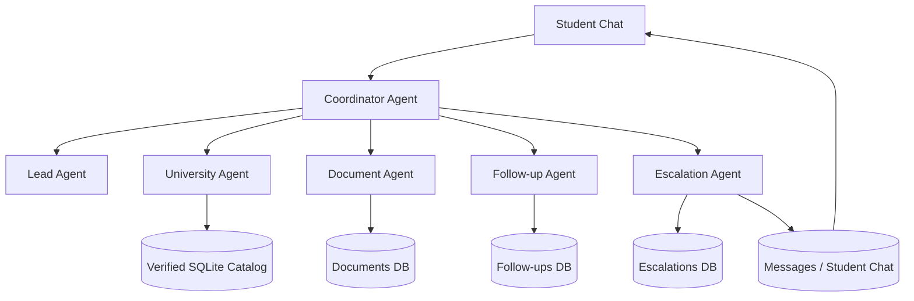

# AdmitCrew

An agentic AI admissions management system that combines a student-facing admissions assistant with a staff case-management workspace—grounded in a verified university/program catalog rather than allowing the AI to invent admissions information.

AdmitCrew solves the problem of unreliable AI admissions advice by grounding every factual response in a verified SQLite catalog of 15 university programs across UK, Canada, Germany, and Australia. Students converse naturally with an AI assistant that extracts profile data, recommends programs, and answers questions—while staff oversee escalations, manage applications, and maintain the catalog.

---

## Overview

AdmitCrew has two complementary interfaces:

### 1. Student AI Experience (`/chat`)
A conversational admissions assistant that:
- Conducts natural-language intake (name, phone, country, marks, IELTS, budget)
- Recognizes returning students by phone to avoid duplicate records
- Recommends programs from the **verified catalog** using profile-aware filtering
- Answers specific program questions (fees, deadlines, requirements, documents)
- Maintains conversational context ("What about its fee?" → understands "its" refers to the last program discussed)
- Performs eligibility comparisons against catalog minimums (without guaranteeing admission)
- Escalates unknown/unverified universities to staff instead of hallucinating

### 2. Staff Operations Workspace (`/staff`)
A case-management dashboard where staff:
- View an **Overview dashboard** with pipeline metrics, attention items, and recent activity
- Manage **Leads** (search, view student cases)
- Drill into **Student Cases** with tabs for Overview, Applications, Documents, Tasks, Follow-ups, Escalations, Activity
- Manage **Applications** through a status pipeline (preparing → ready → submitted → under_review → offer_received/rejected/withdrawn)
- Run **Document checks** (passport expiry, name matching, IELTS score validation)
- Create and track **Tasks** with due dates, priorities, and auto-generated deadline tasks from catalog data
- Run **Follow-up detection** (drafts reminders for inactive students; staff approve before sending)
- Resolve **Escalations** (write verified responses that are delivered back to the student's chat)
- Maintain the **Programs Catalog** (search, filter by country, view all verified facts)

---

## Key Features

### Agentic AI Admissions Assistant
| Capability | Description |
|------------|-------------|
| **Natural-language intake** | Extracts multiple fields from a single message (name, marks, IELTS, country, phone, budget) |
| **Returning student detection** | Phone-based lookup prevents duplicate lead records |
| **Profile-aware discovery** | "Based on my profile, which programs suit me?" filters by saved country, marks, IELTS |
| **Subject + country filtering** | "Computer Science programs in the UK" → exact catalog matches |
| **Exact program lookup** | "University of Manchester BSc Computer Science" → exact verified record |
| **Contextual follow-ups** | "What about its fee?" / "Do I meet its requirements?" resolve to last discussed program |
| **Eligibility comparison** | "Do I meet its requirements?" compares stored marks/IELTS vs catalog minimums |
| **No admission guarantees** | Explicit disclaimer: meeting minimums ≠ admission guarantee |
| **Safe fallback** | Deterministic local routing when Gemini is unavailable |

### Verified University Catalog
| Aspect | Detail |
|--------|--------|
| **Scope** | 15 programs across UK, Canada, Germany, Australia |
| **Data fields** | University, country, program, fee/year, deadline, min marks, min IELTS, required documents |
| **Filtering** | By country, free-text search (university, program, documents) |
| **Exact lookup** | University + program pair resolves to exactly one catalog record |
| **Ambiguity handling** | "BSc Computer Science" (offered by Manchester & Toronto) → asks for clarification |
| **No invented facts** | Every response sourced from SQLite catalog; unknowns escalate to staff |

### Human-in-the-Loop Escalation
Complete lifecycle:
1. Student asks about unverified university/program
2. **Escalation created** with lead, conversation, question, reason, source agent
3. Staff views in **Escalations** page (Open / Resolved tabs)
3. Staff writes **verified response** → clicks **Resolve & respond**
4. Response is **persisted to the student's conversation** (sender: "staff")
4. Student sees staff response in chat history with distinct "Staff" label + GraduationCap icon
5. **Duplicate protection**: identical staff response on re-resolve → no duplicate message; different response → error

### Staff Case Management
| Module | Capabilities |
|--------|-------------|
| **Overview** | Metrics (leads, active apps, offers, doc problems, follow-ups, escalations, overdue tasks), pipeline bars, attention queue, recent activity |
| **Leads** | Search, paginate, link to student case |
| **Student Case** | Tabs: Overview, Applications, Documents, Tasks, Follow-ups, Escalations, Activity |
| **Applications** | Create (student + verified program), status pipeline, case notes, document readiness gate |
| **Documents** | Manual check (passport expiry, name match, IELTS score), status/result, student linkage |
| **Tasks** | CRUD, due dates, priorities, overdue/upcoming filters, auto-generate from catalog deadlines |
| **Follow-ups** | AI drafts → staff approve → sent; deduplication by inactivity event key |
| **Escalations** | Open/Resolved tabs, detail view, resolve with staff response → auto-delivers to student chat |
| **Programs** | Search, country filter, verified catalog (15 programs) |
| **Agent Activity** | Timeline with system-event de-emphasis (scan/check/sync events at 65% opacity) |

### Applications
- **Status pipeline**: `preparing` → `ready` → `submitted` → `under_review` → `offer_received` / `rejected` / `withdrawn`
- **Transition rules**: enforced (e.g., `ready` requires all required documents valid)
- **Document readiness gate**: blocks `preparing → ready` if passport/transcript/IELTS missing or problematic
- **Case notes**: append-only per application
- **Duplicate prevention**: unique constraint on (lead_id, program_id)

### Documents
- **Manual check workflow** (no OCR/upload pipeline): staff enters document type, filename, name on document, expiry/IELTS → system validates
- **Checks**: passport expiry, name mismatch, IELTS score range (0–9)
- **Result**: `ok` / `problem` with details; persisted per document
- **Student case Documents tab**: lists all checks with status/result

### Tasks & Follow-ups
| Feature | Behavior |
|---------|----------|
| **Tasks** | CRUD, due dates, priorities, overdue/upcoming/completed filters, auto-complete on application submission |
| **Deadline generation** | From application → reads program catalog deadline → creates `application_submission` task (deduped by `automatic_key`) |
| **Follow-ups** | Detection runs every 3 days of inactivity → drafts pending reminder → staff **must approve** before sending |
| **Deduplication** | Follow-ups keyed by `inactivity_event_key` (last_reply_at) prevents duplicates |

---

## Agent Architecture



| Agent | Responsibility |
|-------|----------------|
| **Coordinator Agent** | Primary router; Gemini-primary for NLU, deterministic `local_classify` fallback; routes to specialist agents |
| **Lead Agent** | CRUD, phone-based dedup, profile validation, intake extraction (with Gemini assist) |
| **University Agent** | Catalog queries: search, filter, exact lookup, parse filters, eligibility checks |
| **Document Agent** | Document checks (passport expiry, name match, IELTS), result persistence |
| **Task Agent** | CRUD, deadline generation from catalog, overdue/upcoming scans, auto-complete on submit |
| **Follow-up Agent** | Inactivity detection (3 days), draft creation, staff approval required, dedup by event key |
| **Escalation Agent** | CRUD, open/in_progress/resolved states, staff response → inserts into student conversation, duplicate prevention |
| **Dashboard Agent** | Aggregates metrics: leads, pipeline, attention items, activity feed |
| **Application Agent** | CRUD, status transitions with rules, document readiness gate, notes, duplicate prevention |

**Routing principle**: Gemini handles NLU when available; deterministic `local_classify`/`local_understand_message` provide safe fallback. **All university facts come from SQLite**—agents never invent catalog data.

---

## Grounding & AI Safety

| Principle | Implementation |
|-----------|----------------|
| **Verified facts only** | All university/program data from SQLite `programs` table; agents never invent facts |
| **No admission guarantees** | Eligibility responses explicitly state: "Meeting listed minimums is not a guarantee of admission" |
| **Unknown = escalate** | Questions about universities/programs not in catalog → `unknown_university` intent → escalation |
| **Ambiguity = clarify** | Program names at multiple universities (e.g., "BSc Computer Science") → `clarify_program` intent |
| **Deterministic fallback** | `local_classify`/`local_understand_message` handle routing when Gemini unavailable/quota-exceeded |
| **No hallucinated responses** | Staff responses written by humans; AI never generates admissions decisions |

---

## Tech Stack

| Layer | Technologies |
|-------|-------------|
| **Frontend** | React 19, TypeScript, Vite 8, React Router 7, Framer Motion, Lucide React |
| **Backend** | FastAPI, Python 3.11+, Uvicorn, Pydantic v2, PyJWT, google-genai (Gemini), pwdlib (argon2) |
| **Database** | SQLite (file-based, `data/admitcrew.db`), `PRAGMA foreign_keys = ON` |
| **Auth** | JWT (HS256), HTTPBearer, role-based (`admin`/`counselor`), bcrypt via `pwdlib` |
| **AI/ML** | Google Gemini (`gemini-3.8-flash`) via `google-genai` SDK |
| **Build/Dev** | Vite 8, TypeScript 6, Oxlint, pnpm/npm |
| **Testing** | Custom Python regression suite (15 tests) |

---

## Project Structure

```
AdmitCrew/
├── backend/
│   ├── agents/
│   │   ├── __init__.py
│   │   ├── application_agent.py
│   │   ├── coordinator_agent.py
│   │   ├── dashboard_agent.py
│   │   ├── document_agent.py
│   │   ├── escalation_agent.py
│   │   ├── followup_agent.py
│   │   ├── lead_agent.py
│   │   ├── task_agent.py
│   │   └── university_agent.py
│   ├── routes/
│   │   ├── applications.py
│   │   ├── auth.py
│   │   ├── chat.py
│   │   ├── dashboard.py
│   │   ├── documents.py
│   │   ├── escalations.py
│   │   ├── followups.py
│   │   ├── leads.py
│   │   ├── programs.py
│   │   ├── staff.py
│   │   └── tasks.py
│   ├── auth.py
│   ├── database.py
│   ├── main.py
│   ├── requirements.txt
│   ├── seed.py
│   └── test_regression.py
├── frontend/
│   ├── public/
│   ├── src/
│   │   ├── components/
│   │   │   ├── StaffShell.tsx
│   │   │   └── ui.tsx
│   │   ├── pages/
│   │   │   ├── CaseworkPages.tsx
│   │   │   ├── ChatPage.tsx
│   │   │   ├── LoginPage.tsx
│   │   │   └── OverviewPage.tsx
│   │   ├── api.ts
│   │   ├── App.tsx
│   │   ├── auth.tsx
│   │   ├── index.css
│   │   ├── main.tsx
│   │   └── types.ts
│   ├── index.html
│   ├── package.json
│   ├── tsconfig.json
│   └── vite.config.ts
├── data/
│   └── admitcrew.db          (SQLite database, created on first run)
├── .env                       (environment variables, not committed)
├── .gitignore
├── package.json               (root, for frontend workspace)
└── README.md
```

---

## Local Setup

### Prerequisites
- Python 3.11+
- Node.js 20+ (with npm/pnpm)
- Git

### 1. Clone & Install Frontend
```bash
cd D:\Projects\AdmitCrew\frontend
npm install
```

### 2. Backend Virtual Environment & Dependencies
```bash
cd D:\Projects\AdmitCrew\backend
python -m venv .venv
.\.venv\Scripts\activate
pip install -r requirements.txt
```

### 3. Environment Variables
Create `.env` in project root (`D:\Projects\AdmitCrew\.env`):
```env
GEMINI_API_KEY=your_gemini_api_key_here
ADMITCREW_JWT_SECRET=a_secure_random_string_at_least_32_bytes
ADMITCREW_ENV=development
# Optional (for admin bootstrap):
# ADMITCREW_ADMIN_NAME=Admin Name
# ADMITCREW_ADMIN_EMAIL=admin@example.com
# ADMITCREW_ADMIN_PASSWORD=secure_password_12+
```

> **Note**: The project uses a local development JWT secret fallback when `ADMITCREW_ENV=development`. In production, `ADMITCREW_JWT_SECRET` must be set.

### 4. Initialize Database & Seed Catalog
```bash
cd D:\Projects\AdmitCrew\backend
.\.venv\Scripts\python.exe seed.py
```
This creates `data/admitcrew.db` with 15 verified programs and 3 test leads.

### 5. (Optional) Bootstrap Admin User
```bash
cd D:\Projects\AdmitCrew\backend
.\.venv\Scripts\python.exe bootstrap_admin.py
```
Requires `ADMITCREW_ADMIN_NAME`, `ADMITCREW_ADMIN_EMAIL`, `ADMITCREW_ADMIN_PASSWORD` in `.env`.

### 5. Start Backend
```bash
cd D:\Projects\AdmitCrew\backend
.\.venv\Scripts\python.exe -m uvicorn main:app --reload
```
Backend runs at `http://localhost:8000` (API docs at `/docs`)

### 6. Start Frontend
```bash
cd D:\Projects\AdmitCrew\frontend
npm run dev
```
Frontend runs at `http://localhost:5173` (proxies API calls to `http://localhost:8000`)

### 7. Open in Browser
- **Student Chat**: `http://localhost:5173/chat`
- **Staff Workspace**: `http://localhost:5173/staff` (login with bootstrapped admin credentials)

---

## Environment Variables

| Variable | Required | Description |
|----------|----------|-------------|
| `GEMINI_API_KEY` | **Yes** | Google Gemini API key (get from Google AI Studio) |
| `ADMITCREW_JWT_SECRET` | **Yes** | HS256 signing secret (≥32 bytes); dev fallback if `ADMITCREW_ENV=development` |
| `ADMITCREW_ENV` | No | `development` or `production` (default: production) |
| `ADMITCREW_ADMIN_NAME` | For bootstrap | Initial admin name |
| `ADMITCREW_ADMIN_EMAIL` | For bootstrap | Initial admin email (unique) |
| `ADMITCREW_ADMIN_PASSWORD` | For bootstrap | Initial admin password (12+ chars) |
| `ADMITCREW_ACCESS_TOKEN_MINUTES` | No | Access token TTL (default: 30) |

---

## Testing

### Backend Regression Suite (15 tests)
```bash
cd D:\Projects\AdmitCrew\backend
.\.venv\Scripts\python.exe test_regression.py
```
**Expected**: 15 passed, 0 failed

**Coverage**:
- Manchester vs Toronto program collision resolution
- Ambiguous program clarification
- Contextual follow-ups (fee, documents, eligibility)
- Eligibility comparison with profile
- Unknown university escalation
- Profile-aware catalog discovery
- Subject + country filtering
- Exact catalog lookup (exact university+program pair)
- Escalation creation → resolution → student chat delivery
- Duplicate staff response prevention
- Staff response appears in student history

### Frontend Checks
```bash
cd frontend
npm run build       # Production build (Vite + tsc -b)
npm run typecheck   # TypeScript strict check (tsc -b)
npm run lint        # oxlint (if runnable in environment)
```

---

## Security & Data Handling

| Protection | Implementation |
|------------|----------------|
| **Staff authentication** | JWT (HS256), Bearer tokens, role-based (`admin`/`counselor`) |
| **Authorization** | Route-level `require_staff` / `require_admin` dependencies |
| **SQL safety** | All queries parameterized (`?` placeholders); `PRAGMA foreign_keys = ON` |
| **Secrets management** | `.env` excluded via `.gitignore`; JWT secret from env |
| **Escalation linkage** | Staff response inserted into correct `conversation_id` |
| **Duplicate prevention** | Escalation dedupe key (lead+conversation+question); staff response equality check |
| **No secrets in frontend** | Only public env vars; JWT secret server-side only |
| **Audit logging** | `agent_logs` table captures agent actions with details |

---

## Screenshots

> Screenshots/demo coming soon.

---

## Limitations

| Limitation | Detail |
|------------|--------|
| **Gemini API quota** | Free tier: ~20 requests/day; deterministic `local_classify` fallback handles all routing when quota exhausted |
| **Deterministic fallback** | Local router covers catalog queries, intake, escalations; no AI reasoning when quota exhausted |
| **No browser E2E suite** | Playwright/Cypress not configured; manual verification required |
| **Catalog scope** | Limited to 15 seeded programs (UK, Canada, Germany, Australia) |
| **Document workflow** | Manual check entry only; no OCR/upload pipeline |
| **Admin bootstrap** | Requires env vars; no self-service registration |
| **Follow-up detection** | Uses `last_reply_at` string parsing (relative + ISO formats) |
| **Admin bootstrap password** | Must be provided via env; no default |

---

## Status

**Completed project / final tested build**
- ✅ 15/15 regression tests passing
- ✅ Frontend production build passing (`vite build`)
- ✅ TypeScript strict check passing (`tsc -b`)
- ⚠️ Lint not runnable in current environment (oxlint blocked by execution policy)

> Not enterprise-certified or production-hardened. Suitable for demonstration, evaluation, and further development.

---

## Author

**M. Mahad Shah**  
AI Automation Engineer  
GitHub: [https://github.com/mahadshahtech](https://github.com/mahadshahtech)